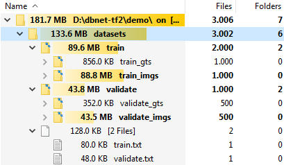

# TFDBNet
A TensorFlow 2 reimplementation of [Real-time Scene Text Detection with Differentiable Binarization](https://arxiv.org/abs/1911.08947) available as a Python package and using [TedEval](https://github.com/clovaai/TedEval) as evaluation metrics. 

## Data Preparation


Store images in `imgs` folder and groundtruths in `gts` folder. Then, prepare text files for training and validate data in the following format with '\t' as a separator:
- Example for ICDAR 2015 `train.txt`:
```
./datasets/train/train_imgs/img_1.jpg	./datasets/train/train_gts/gt_img_1.txt
./datasets/train/train_imgs/img_2.jpg	./datasets/train/train_gts/gt_img_2.txt
```
- Example for ICDAR 2015 `validate.txt`:
```
./datasets/validate/validate_imgs/img_1.jpg	./datasets/validate/validate_gts/gt_img_1.txt
./datasets/validate/validate_imgs/img_2.jpg	./datasets/validate/validate_gts/gt_img_2.txt
```
You can customize the script in [dir2paths.sh](dir2paths.sh) to generate the above `train.txt` and `validate.txt` for your own dataset. And the groundtruths can be `.txt` files, with the following format:
```
x1, y1, x2, y2, x3, y3, x4, y4, annotation
```
Below is the content of `./datasets/train/train_gts/gt_img_1.txt`:
```
377,117,463,117,465,130,378,130,Genaxis Theatre
493,115,519,115,519,131,493,131,[06]
374,155,409,155,409,170,374,170,###
492,151,551,151,551,170,492,170,62-03
376,198,422,198,422,212,376,212,Carpark
494,190,539,189,539,205,494,206,###
374,1,494,0,492,85,372,86,###
```

## Quick Start
```
pip install tfdbnet
```
After above installation, see the [demo](demo/demo.ipynb) on ICDAR 2015 dataset to know how to use


## Reference
- https://github.com/MhLiao/DB
- https://github.com/zonasw/DBNet
- https://github.com/WenmuZhou/DBNet.pytorch
- https://github.com/xuannianz/DifferentiableBinarization
- https://github.com/clovaai/TedEval
